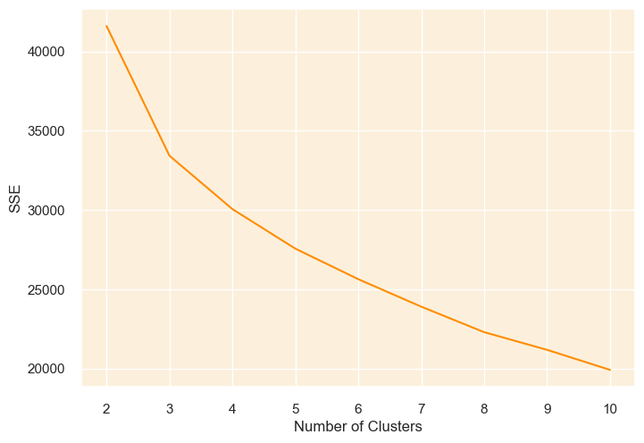
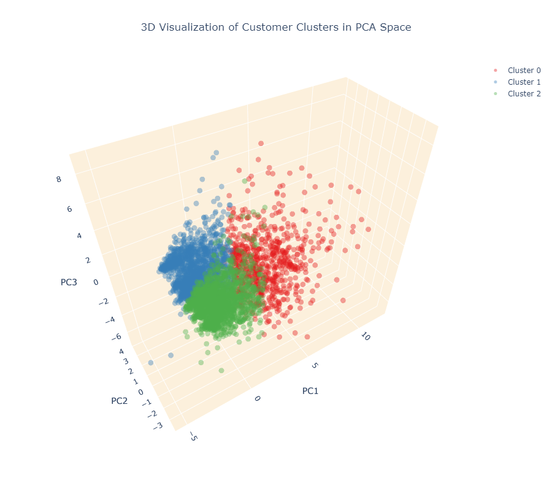
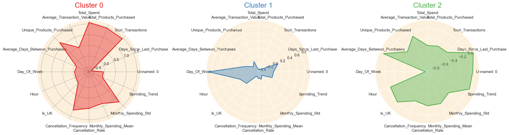

# Clustering Analysis with K-Means and DBSCAN

## Project Overview

This project explores clustering techniques using the K-Means and DBSCAN algorithms to analyze and uncover patterns in data. The project includes comprehensive exploratory data analysis (EDA), visualization of clustering results, and methods to determine the optimal clustering parameters for different datasets.

## Dataset Description

The datasets used in this project consist of various features that are analyzed to identify natural groupings or clusters. Key aspects of the datasets include:

- **Numerical Features**: Continuous variables used to compute distances between points, crucial for clustering algorithms like K-Means and DBSCAN.
- **Categorical Features**: Converted to numerical format or handled specifically when required, depending on the clustering method.

## Project Structure

- **exploratory_data_analysis.ipynb**: Contains the exploratory data analysis and visualizations to understand the data structure and relationships between variables.
- **KMeans2.ipynb**: Implements the K-Means clustering algorithm, including parameter tuning and visualization of results.
- **DBSCAN_Clustering.ipynb**: Applies the DBSCAN clustering algorithm and explores the impact of different distance metrics and parameters.

## Methodology

### 1. Exploratory Data Analysis (EDA)

The EDA notebook focuses on understanding the data and its structure, providing insights through visualizations and basic statistics. Key steps include:

- **Missing Data Analysis**: Identification and handling of missing data to ensure data quality.
- **Feature Distribution**: Visualization of feature distributions to understand their spread and skewness.
- **Correlation Analysis**: Analysis of feature correlations using a heatmap to identify potential relationships.
- **Key Visualizations**:
  - **Correlation Heatmap**:
    

### 2. K-Means Clustering

The K-Means clustering notebook covers the following steps:

- **Data Standardization**: Normalization of features to ensure that each has a mean of 0 and a standard deviation of 1, which is critical for distance-based algorithms like K-Means.
- **Elbow Method**: Used to determine the optimal number of clusters by plotting the sum of squared distances (inertia) against the number of clusters.
- **Silhouette Method**: Used to determine the silhouette score for each number of clusters and analyse the silhouette plots, to have clusters that are as equally distributed as possible
- **Model Implementation**: Applying the K-Means algorithm with the chosen number of clusters and analyzing the results.
- **Visualization**:
  - **Elbow Plot**:
    
  - **Cluster Plot**:
    

### 3. DBSCAN Clustering

The DBSCAN clustering notebook includes:

- **Parameter Tuning**: Experimentation with different values of `eps` and `min_samples` to find the optimal parameters for clustering.
- **Distance Metrics**: Exploration of different distance metrics to understand their impact on clustering results.
- **Model Implementation**: Applying the DBSCAN algorithm and visualizing the clusters and noise points.
- **Outcome**: Although various values for `eps` and `min_samples` were tried and even optimized for using GridSearchCV, the resulting clusters did not provide any meaningful insight into customer behaviour.

### Key Findings

#### Radar Chart for Customer Behaviour

#### Cluster 0 (Red)

- High Spenders
    This cluster stands out with the highest Total Spend, Average Transaction Value, Total Transactions, and Monthly Spending Mean. They likely represent the most valuable customers.
- Frequent Buyers
    They also have a high number of Unique Products Purchased, indicating a broader interest in distinct products.
- Active & Engaged
    The relatively low Average Days Between Purchases and Days Since Last Purchase suggest that these customers shop frequently.
- Higher Cancellation Frequency
    This cluster has a noticeably higher Cancellation Frequency than the others.

### Cluster 1 (Blue)

- Low Spenders
    This cluster shows the lowest levels of Total Spend, Average Transaction Value, and Monthly Spending Mean. Customers in this cluster likely only buy out of necessity. They may also represent less engaged or price-sensitive customers.
- Negligible Interest in Variety
    Compared to the other clusters, they have fewer Total Transactions and Unique Products Purchased, suggesting less frequent purchases and a fixed narrow product interest.
- High Engagement
    Low Average Days Between Purchases and Days Since Last Purchase indicate frequent shopping behavior like Cluster 0.
- Low Cancellation Frequency
    This cluster has a low cancellation frequency potentially indicationg the customers are generally satisfied with their purchases. Although they don't spend much, they don't cancel often.

### Cluster 2 (Green)

- Moderate Spenders
    This cluster exhibits moderate values across most spending metrics, including Total Spend, Average Transaction Value, Total Transactions, and Monthly Spending Mean. These customers are placed between the customers of Cluster 0 and Cluster 1.
- Average Product Interest
    Moderate Unique Products Purchased suggests an interest in some products or categories.
- Infrequent Buyers
    The high Average Days Between Purchases and Days Since Last Purchase indicate infrequent shopping behavior.
- Medium Cancellation Frequency
The customers cancel in a moderate amount.

## Conclusion

This project demonstrates the application of clustering algorithms to uncover hidden patterns and groupings within data. Through careful parameter tuning and visualization, we can effectively identify meaningful clusters, providing valuable insights into the underlying data structure.

 
